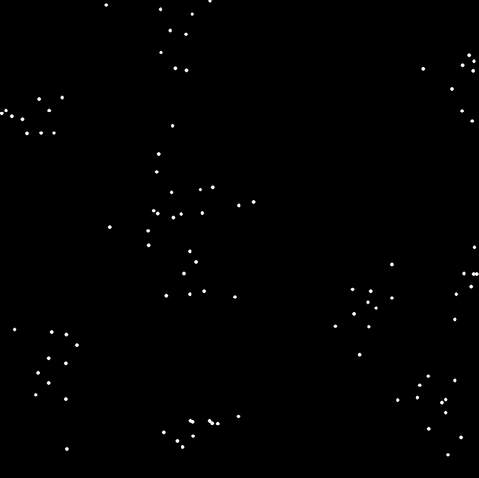
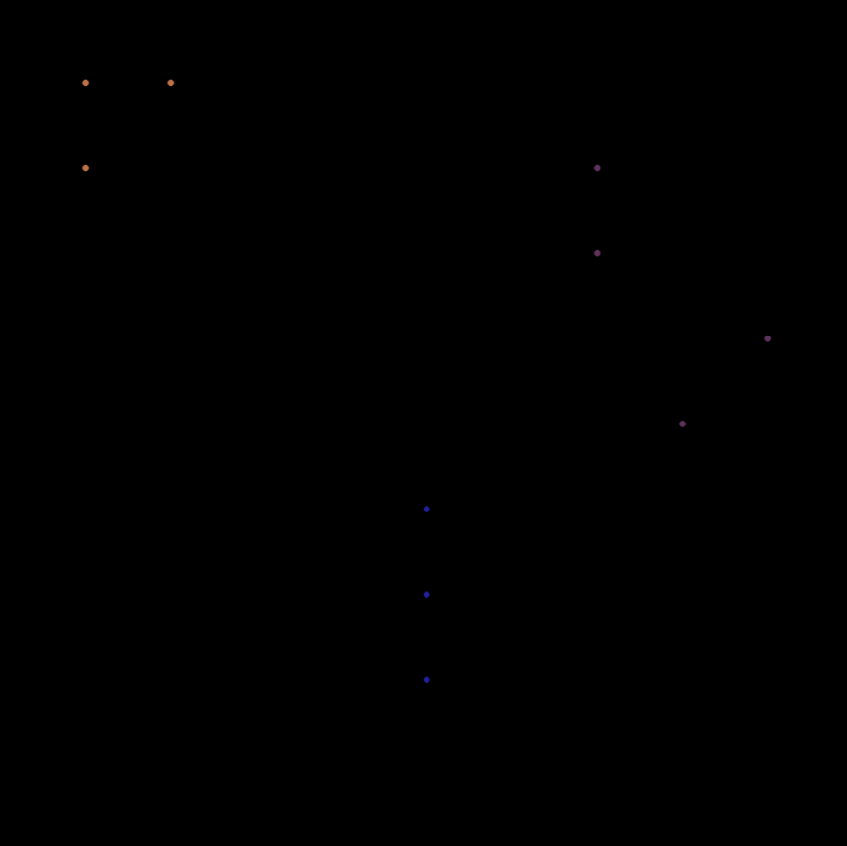

# Grouping problem solving

A program for grouping a set of points into N clusters

## Goals

- [x] definition of problem entities
- [x] visualization method
- [ ] add genetic algorithm solution
- [ ] add other numerical optimization method
- [x] add pipeline
- [x] add load from file

## Configure, build and run

Configure:
```
mkdir build
cd build
cmake ..
```

Configure with visualization (OpenCV required):
```
mkdir build
cd build
cmake .. -DENABLE_VISUALIZATION=ON
```

To build run `build_script.sh` in repository root directory

To parse your own input files, place your .json file in /tmp folder and run the command:
```
./build/_deps/flatbuffers-build/flatc -o ./tmp -b ./schemas/problem.fbs ./tmp/your_file_name.json
```
or parse the example .json
```
./build/_deps/flatbuffers-build/flatc -o ./tmp -b ./schemas/problem.fbs ./example/exampleProblem.json
```

To run program, execute ./build/app/groupingProblem with path to problem .bin file as first argument (or without arguments to randomly generate a problem).

## Problem entities

Problem structures are defined in src/problemEntities. Each problem instance requires at least two parameters - `problemSize`, which is the number of points, and `numberOfClasses` which is the number of clusters the points are going to be grouped into. The user can also provide their own set of points, but it is not necessary - the `populate` function generates points belonging roughly to the specified number of clusters using the normal distribution to simulate the real example of the problem.

## Visualization

The prerequisites are OpenCV library installed on the machine. After configuring with `-DENABLE_VISUALIZATION=ON`, it is possible to plot both the unsolved problem - a set of points on a plane - and the solved version - points belonging to certain clusters signified by distinct colours. Drawing functions are defined in app/visualization.

### Unsolved problem example (problem size = 100)



### Solved problem example (problem size = 10, number of classes = 3)


